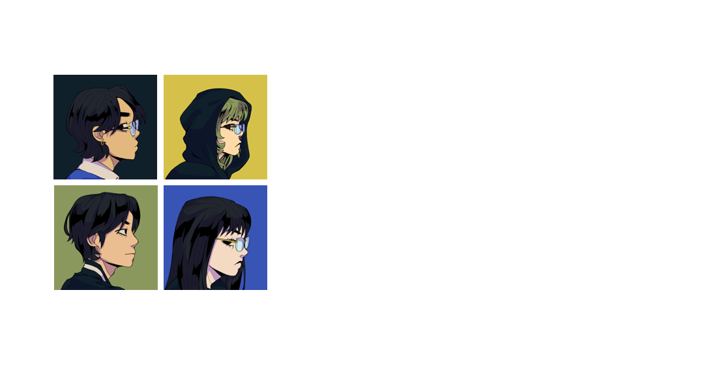

  

## _100 Days in Metro Manila – CMS Website_

> _A narrative-driven digital platform supporting environmental awareness through interactive media._

---

🎮 **Game Companion Website**  
🌱 **Environmental Education Platform**  
🧩 **Content Management System (CMS)**

---

## 📖 Project Overview

This repository contains the official **Content Management System (CMS) Website** for _100 Days in Metro Manila_, a 3D single-player role-playing game designed to promote **environmental awareness and responsibility**.

The platform functions as both a **promotional hub** and an **educational extension**, allowing users to explore the game's world, assets, and underlying environmental themes beyond gameplay.

---

## 🌍 Concept & Vision

At its core, this project bridges **interactive storytelling** and **real-world environmental issues**.

The website extends the game’s philosophy by:

- Presenting **pollution as a systemic consequence of human action**
- Reinforcing **cause-and-effect relationships** through curated content
- Encouraging users to reflect on **sustainability and responsibility**

---

## 🎮 About the Game

**100 Days in Metro Manila** is a time-constrained action-adventure RPG where players must restore a post-polluted city within 100 in-game days.

### Environmental Stages:

- 🌫️ **Smog District** — Air Pollution
- 🌊 **Toxic Waterway** — Water Pollution
- 🗑️ **Waste Grounds** — Land Pollution
- 🌆 **Heart of Metro Manila** — Mixed Pollution

---

## 🌐 Website Architecture

The system is structured into modular pages designed for clarity, accessibility, and content scalability.

### 🏠 Home

- Game introduction and narrative context
- Embedded trailer and media highlights
- Download access point
- Featured visual previews

### 🧩 Collections

- Character archive with design insights
- Enemy bestiary categorized by pollution type
- Environmental asset gallery with descriptions

### 👥 About Us

- Team identity and development philosophy
- Mission and vision statements
- Individual contributor profiles

### 📩 Contact

- Direct communication form
- Social media integration
- User inquiry channel

---

## 🔐 Administrative Control (CMS)

The platform includes a **restricted admin interface** with full system privileges.

### Admin Capabilities:

- Dynamic content management
- Asset uploading and replacement
- Game file updates and deployment
- Structural and layout adjustments

> ⚠️ Admin access is secured and not exposed to public users.

---

## 👤 User Experience Flow

| User Type       | Access Level                    |
| --------------- | ------------------------------- |
| Visitor         | Browse public pages             |
| Registered User | Access full gallery/collections |
| Admin           | Full CMS control                |

---

## 🛠️ System Purpose

This CMS website is designed to:

- 📢 Promote the game and its narrative message
- 📚 Provide structured educational content on pollution
- 🖼️ Showcase visual and design assets
- 🔄 Enable continuous content updates through CMS
- 🤝 Support community interaction and engagement

---

## 🎓 Academic Context

This project is developed as part of a **Bachelor of Science in Information Technology**  
Major in **Animation and Game Development (AGD)**

It serves as a **capstone output**, integrating:

- Game Development
- Web Development (CMS)
- Environmental Education
- User Experience Design

---

## 📌 Repository Notes

- This repository contains **website source code only**
- Game builds are distributed via the website
- Content updates are managed through the CMS

---

## 📄 License

This project is intended for **academic, research, and educational use only**.  
All assets and materials are used under appropriate permissions.

---

✨ _“Small actions shape systems. Systems shape the future.”_

